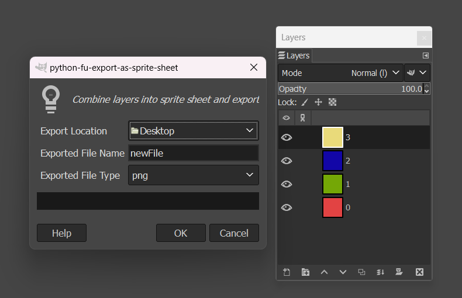
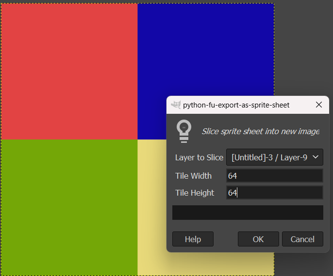
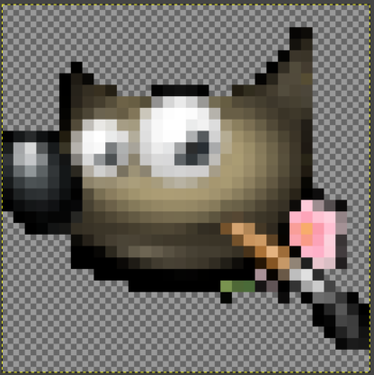
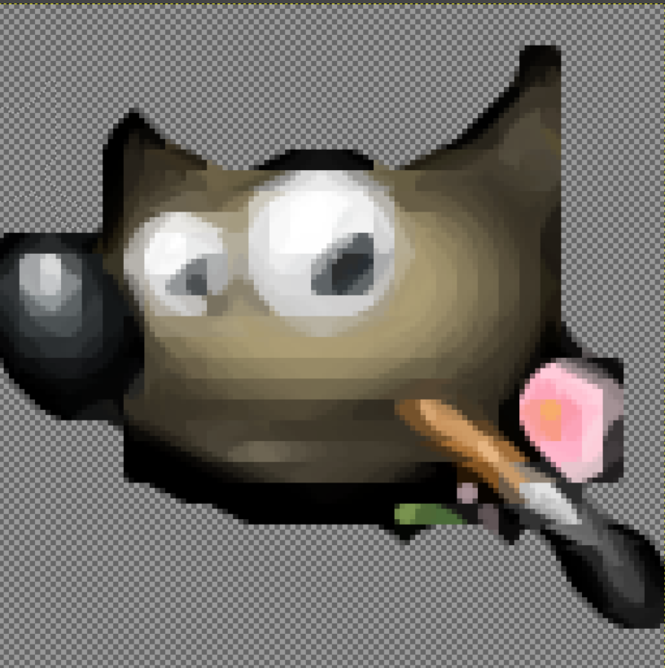

# GIMP PixelToolkit

Collection of pixel art-focused plugins for GIMP Image Editing Software.

## Adding Plugins to GIMP

1. Locate your GIMP plug-in directory, this can be found within GIMP under `Edit > Preferences > Folders > Plug-ins`
2. Copy all files and folders from this project's `Plugins` directory to the GIMP `plug-ins` directory.
3. Restart GIMP.

## Included Plugins

### Sprite Sheet Exporter

- Allows you to combine all working layers of an image into a packed sprite sheet and export it to a chosen folder. Original image and layers remain unchanged.
- Located under `Image > PixelToolkit > Export As Sprite Sheet`

### Sprite Sheet Slicer

- Simple sprite sheet utility designed to divide a packed tile sheet into individual layers.
- Located under `Image > PixelToolkit > Slice Sprite Sheet`

### xBRZ Scaler

- Creates a non-destructive xBRZ-scaled image of active layer
- Located under `Image > PixelToolkit > xBRZ Scale`

32x32
  
128x128
